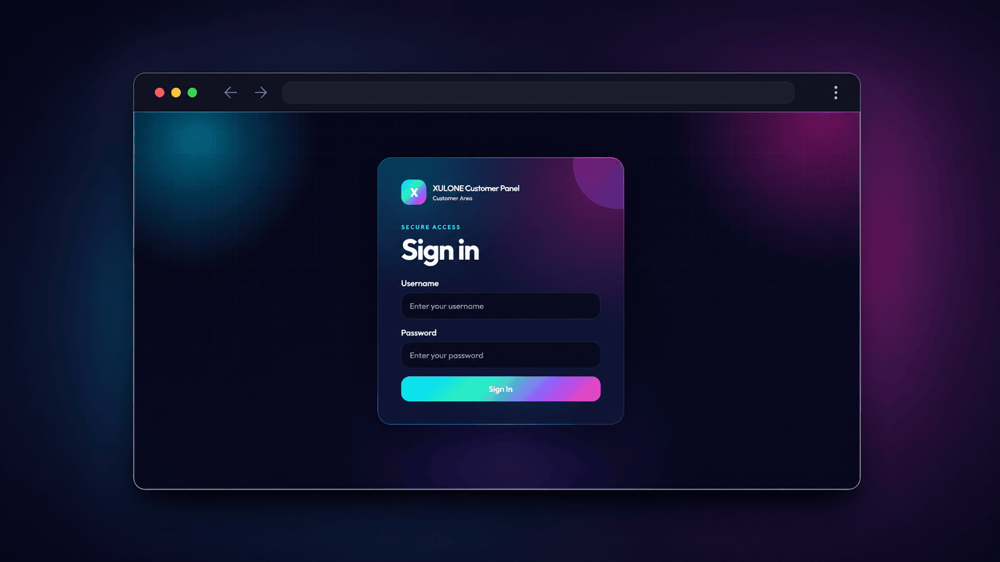
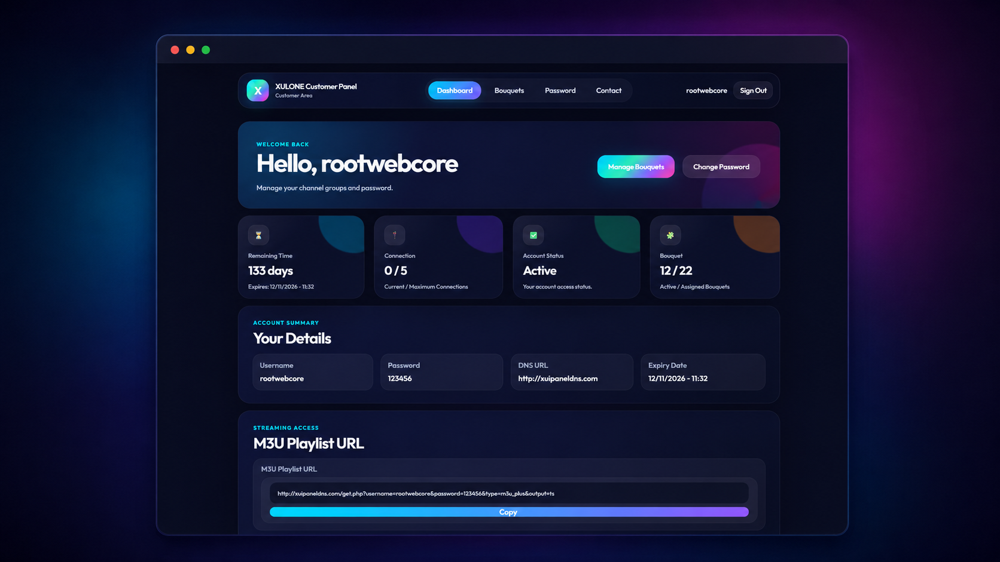
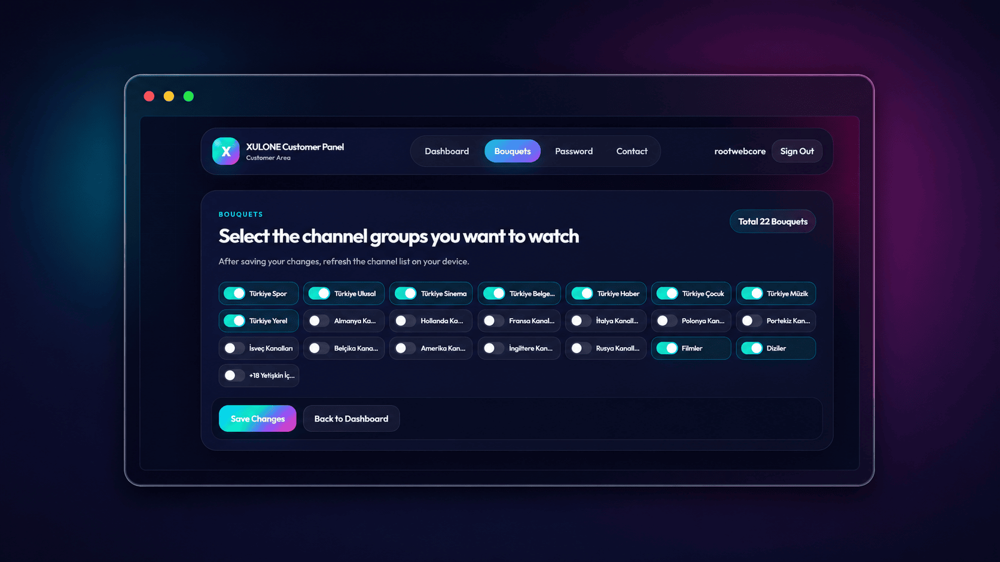
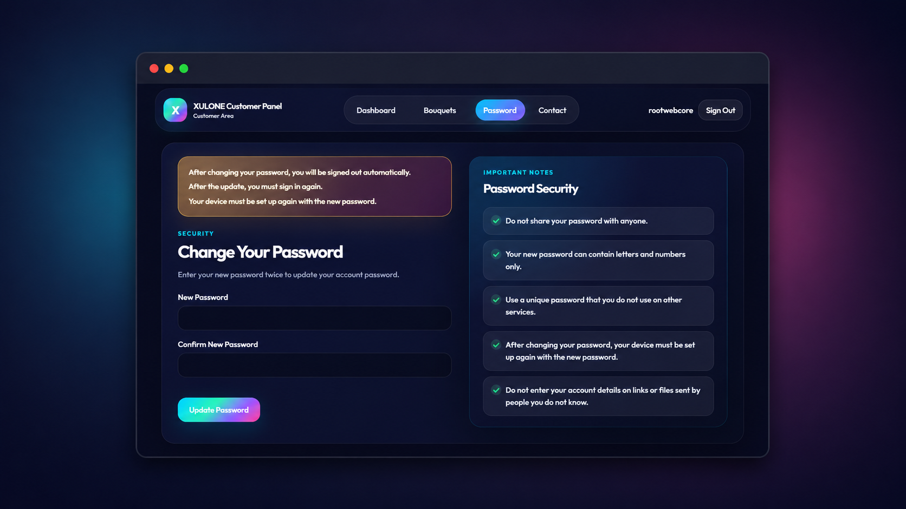

<p align="center">
  
</p>

<br>

# ⚡ XUI.ONE Customer Panel

A modern, lightweight customer panel for **XUI.ONE** based IPTV services.  
Customers can sign in with their line username and password, view subscription details, manage assigned bouquet/channel groups, change their password, and copy their M3U playlist URL from one clean interface.

> Built with plain PHP. No framework, no database, easy upload, easy configuration.

---

## ✨ Features

- 🔐 **Customer login** with XUI.ONE line username and password
- 📊 **Dashboard** with account details, expiry date, connection count and bouquet summary
- 🧩 **Bouquet management** for customer-assigned package/bouquet groups
- 🔑 **Password change** with automatic sign-out after update
- 📺 **M3U playlist URL** display with one-click copy button
- 📱 **Fully responsive design** with mobile hamburger menu
- 🎨 **Modern dark UI** with vibrant colors and clean cards
- 📩 **Configurable contact menu** for email, Telegram, WhatsApp or support URL
- 🛡️ **Security-focused defaults** for sessions, CSRF, rate limiting and protected files
- 🚀 **cPanel and Plesk compatible**

---

## ✅ Ready in 3 Steps

| Step | What You Do | Result |
|---|---|---|
| 1️⃣ Upload | Upload the files to cPanel or Plesk | The panel files are ready on your hosting |
| 2️⃣ Conf. | Copy `config.example.php` to `config.php` and enter your XUI.ONE API details | The panel connects to your XUI.ONE server |
| 3️⃣ Use | Customers sign in with their line username and password | They can manage bouquets, password and playlist URL |

---

## 🧰 Requirements

- PHP **8.1+**
- PHP cURL extension
- PHP JSON extension
- Apache `.htaccess` support for clean URLs
- XUI.ONE panel with **Admin API** access enabled
- cPanel, Plesk or any compatible PHP hosting environment

---

## 🔌 How It Works

This panel uses:

- **XUI.ONE Player API** to verify customer login credentials
- **XUI.ONE Admin API** to read account, package and bouquet details
- **XUI.ONE Admin API mysql_query action** to update only the required line fields:
  - `lines.bouquet` for bouquet preferences
  - `lines.password` for password changes

The customer never sees your Admin API key. All API calls are executed server-side.

---

## 🛠️ Installation on cPanel

1. Open **cPanel → File Manager**.
2. Go to your domain folder, usually `public_html` or a subfolder such as `public_html/xpanel`.
3. Upload all project files.
4. Rename or copy:

```text
config.example.php → config.php
```

5. Open `config.php` and enter your XUI.ONE details:

```php
'base_url' => 'https://your-xui-panel.com:port',
'access_code' => 'YOUR_ADMIN_API_ACCESS_CODE',
'api_key' => 'YOUR_ADMIN_API_KEY',
```

6. Open your panel URL:

```text
https://yourdomain.com/xpanel
```

---

## 🛠️ Installation on Plesk

1. Open **Plesk → Domains → Your Domain → Files**.
2. Upload all project files into `httpdocs` or your selected subfolder.
3. Rename or copy:

```text
config.example.php → config.php
```

4. Edit `config.php` and enter your XUI.ONE Admin API details.
5. Make sure Apache rewrite rules are enabled for clean URLs.
6. Open the customer panel URL in your browser.

---

## 🔑 Creating XUI.ONE Admin API Access

### 1️⃣ Create Admin API Access Code

1. Sign in to your XUI.ONE admin panel.
2. Go to:

```text
Management → Access Control → Access Codes
```

3. Create a new access code.
4. Select **Admin API** as the access type.
5. Assign it to an administrator group.
6. Save the generated access code.

Use this value in `config.php`:

```php
'access_code' => 'YOUR_ADMIN_API_ACCESS_CODE',
```

### 2️⃣ Create Admin API Key

1. Open your XUI.ONE administrator profile.
2. Find the API key section.
3. Generate or refresh the API key.
4. Save the profile.
5. Copy the API key into `config.php`:

```php
'api_key' => 'YOUR_ADMIN_API_KEY',
```

### 3️⃣ Set Your XUI.ONE URL

Use your panel URL, including protocol and port if needed:

```php
'base_url' => 'https://panel.example.com:8080',
```

or:

```php
'base_url' => 'http://123.123.123.123:25461',
```

---

## ⚙️ Configuration

Main settings are inside `config.php`.

### XUI.ONE Connection

```php
'xui' => [
    'base_url' => 'https://your-xui-panel.com:port',
    'access_code' => 'YOUR_ADMIN_API_ACCESS_CODE',
    'api_key' => 'YOUR_ADMIN_API_KEY',
]
```

### Contact Menu

```php
'contact' => [
    'enabled' => true,
    'label' => 'Contact',
    'type' => 'auto',
    'value' => 'support@example.com',
]
```

Supported contact values:

```text
support@example.com
https://t.me/yourchannel
https://wa.me/905xxxxxxxxx
https://yourdomain.com/support
```

### M3U Playlist URL

```php
'playlist' => [
    'enabled' => true,
    'path' => 'get.php',
    'type' => 'm3u_plus',
    'output' => 'ts',
]
```

Common output values:

```text
ts
m3u8
```

---

## 🖼️ Screenshots

<p align="center">
  
</p>

<p align="center">
  
</p>

<p align="center">
  
</p>

<p align="center">
  
</p>

---

## 🛡️ Security Notes

This package includes several security-focused protections:

- CSRF protection on forms
- Login rate limiting
- Server-side Admin API usage only
- Protected `config.php`, `app/` and `storage/` paths
- Strict session settings
- Secure cookie flags when HTTPS is used
- Basic security headers
- Password policy enforcement
- Direct SQL updates limited to whitelisted table and column names
- Raw API errors hidden in production

A basic security review and PHP syntax check were performed for this package, and no obvious issue was found in the prepared release. You should still test it on your own hosting environment before public production use.

---

## 📁 Project Structure

```text
xui-one-customer-panel/
├── app/
│   ├── Controllers/
│   ├── Core/
│   ├── Services/
│   └── Views/
├── assets/
│   ├── css/
│   ├── img/
│   └── js/
├── screenshots/
├── storage/
├── .htaccess
├── config.example.php
├── index.php
├── LICENSE
└── README.md
```

---

## 🧪 Quick Test

After installation:

1. Open the panel URL.
2. Sign in with an active XUI.ONE line username and password.
3. Check dashboard account details.
4. Open Bouquet Management and save a test change.
5. Open Change Password and test with a temporary line.

---

## 💙 Footer Credit

The footer includes a credit link to:

```text
https://github.com/rootwcore
```

If you keep the footer link unchanged, it helps support future free and open-source projects like this one.  
Thank you for your support. 🙏

---

## ⚠️ Disclaimer

This project is an independent customer panel for XUI.ONE-based services. It is not an official XUI.ONE product and is not affiliated with the XUI.ONE developers.

Use it responsibly and only on systems you own or are authorized to manage.

---

## 📄 License

Released under the MIT License.
